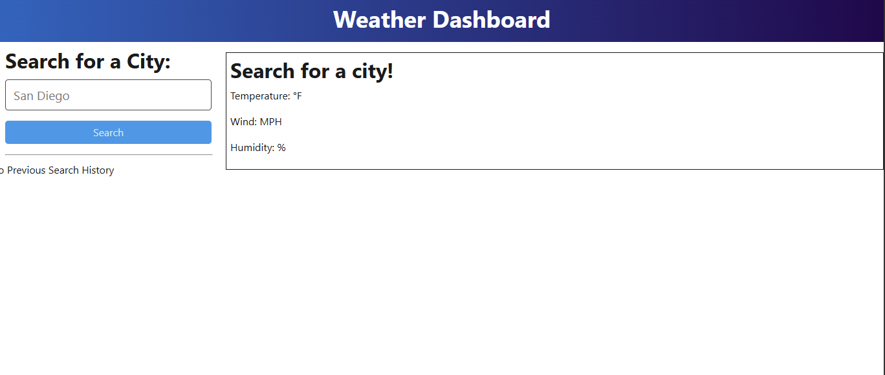

# Weather-Dashboard-Application

  [](https://opensource.org/licenses/MIT)
  
  ## Table of Contents
  
  * [Description](#description)
  * [Installation](#installation)
  * [Usage](#usage)
  * [Contributing](#contributing)
  * [Test](#test)
  * [License](#license)
  * [Questions](#questions)
  
  ## Description
  This application allows the user to retrieve weather data using the Open Weather API and render it on a web browser.

  ## Installation
  Installation Required:  JavaScript, Node JS, Express JS, Vite, TypeScript `fs` package, and `npm`.

  ## Usage 
  Here is an example screenshot of the Weather Dashboard application:

  [Weather Dashboard Application Video Link](https://drive.google.com/file/d/1fdIK35gxklZhVUViSZdUWjV_7RyqdVZX/view)

  
  
  ## Contributing
  The source of contributors I have used in this application:
  * Stack Overlow
  * Teacher Assistance
  * Open Weather Map Website for API Calls
  * Dev Community Website

  
  ## Test 
  ```bash
  npm install
  npm run start:dev
  ```
  Navigate to the filepath of where the code is saved. Type the above code in the terminal. It will start and run the code on the server on both client and server folders.

  ## License
  This project is Licensed under the MIT License.
  
  ## Questions
  Feel Free to contact me for any additional questions
  * GitHub: [jbarry89](https://github.com/jbarry89/)
  * Email: myEmail@gmail.com 
