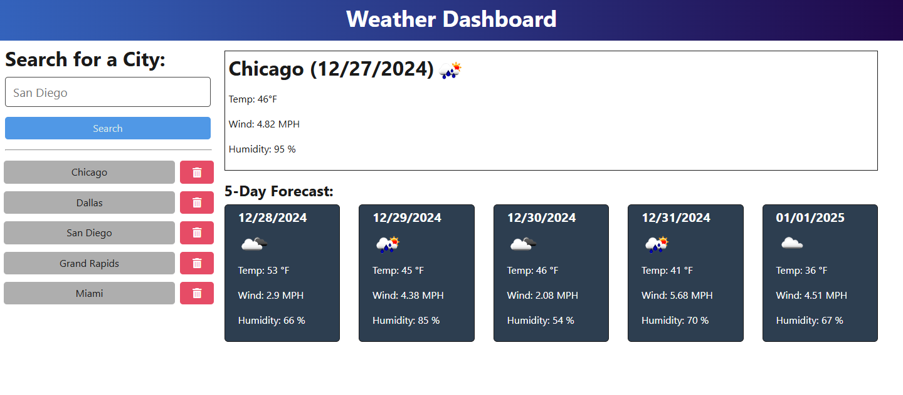

# Weather-Dashboard-Application

  
  
  ## Table of Contents
  
  * [Description](#description)
  * [Installation](#installation)
  * [Usage](#usage)
  * [Contributing](#contributing)
  * [Test](#test)
  * [License](#license)
  * [Questions](#questions)
  
  ## Description
  

  ## Installation
  Installation Required:  JavaScript, Node JS, `inquirer` and `fs` package, and `npm`.

  ## Usage 
  Here is an example screenshot of the Vehicle Builder Typescript application:

  [Weather Dashboard Application Video Link](https://drive.google.com/file/d/16KyDe_zXEui27vndjN_NUxvC63fjBEIO/view)

  
  
  ## Contributing
  The source of contributors I have used in this application:
  * Stack Overlow
  * Teacher Assistance
  * Open Weather Map Website for API Calls
  * Dev Community Website

  
  ## Test 
  N/A

  ## License
  This project is Licensed under the MIT License.
  
  ## Questions
  Feel Free to contact me for any additional questions
  * GitHub: [jbarry89](https://github.com/jbarry89/)
  * Email: myEmail@gmail.com 
